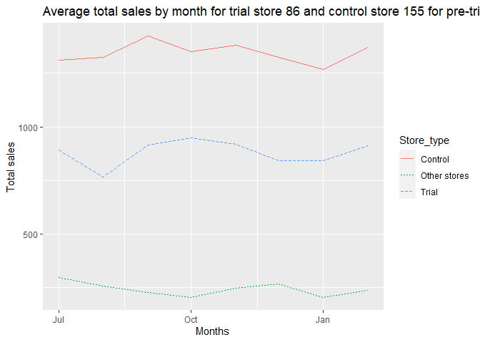

R Notebook
================

# Quantium Virtual Internship - Retail Strategy Analysis - Task 2:

## Installing Librarires if not present

``` r
options(repos = c(CRAN = "https://cloud.r-project.org/"))

install.packages("dplyr")
```

    ## Installing package into 'C:/Users/Jonty2112/AppData/Local/R/win-library/4.2'
    ## (as 'lib' is unspecified)

    ## package 'dplyr' successfully unpacked and MD5 sums checked

    ## Warning: cannot remove prior installation of package 'dplyr'

    ## Warning in file.copy(savedcopy, lib, recursive = TRUE): problem copying
    ## C:\Users\Jonty2112\AppData\Local\R\win-library\4.2\00LOCK\dplyr\libs\x64\dplyr.dll
    ## to C:\Users\Jonty2112\AppData\Local\R\win-library\4.2\dplyr\libs\x64\dplyr.dll:
    ## Permission denied

    ## Warning: restored 'dplyr'

    ## 
    ## The downloaded binary packages are in
    ##  C:\Users\Jonty2112\AppData\Local\Temp\RtmpwFxuPN\downloaded_packages

``` r
install.packages("tidyr")
```

    ## Installing package into 'C:/Users/Jonty2112/AppData/Local/R/win-library/4.2'
    ## (as 'lib' is unspecified)

    ## package 'tidyr' successfully unpacked and MD5 sums checked

    ## Warning: cannot remove prior installation of package 'tidyr'

    ## Warning in file.copy(savedcopy, lib, recursive = TRUE): problem copying
    ## C:\Users\Jonty2112\AppData\Local\R\win-library\4.2\00LOCK\tidyr\libs\x64\tidyr.dll
    ## to C:\Users\Jonty2112\AppData\Local\R\win-library\4.2\tidyr\libs\x64\tidyr.dll:
    ## Permission denied

    ## Warning: restored 'tidyr'

    ## 
    ## The downloaded binary packages are in
    ##  C:\Users\Jonty2112\AppData\Local\Temp\RtmpwFxuPN\downloaded_packages

``` r
install.packages("data.table")
```

    ## Installing package into 'C:/Users/Jonty2112/AppData/Local/R/win-library/4.2'
    ## (as 'lib' is unspecified)

    ## package 'data.table' successfully unpacked and MD5 sums checked

    ## Warning: cannot remove prior installation of package 'data.table'

    ## Warning in file.copy(savedcopy, lib, recursive = TRUE): problem copying
    ## C:\Users\Jonty2112\AppData\Local\R\win-library\4.2\00LOCK\data.table\libs\x64\data_table.dll
    ## to
    ## C:\Users\Jonty2112\AppData\Local\R\win-library\4.2\data.table\libs\x64\data_table.dll:
    ## Permission denied

    ## Warning: restored 'data.table'

    ## 
    ## The downloaded binary packages are in
    ##  C:\Users\Jonty2112\AppData\Local\Temp\RtmpwFxuPN\downloaded_packages

``` r
install.packages("skimr")
```

    ## Installing package into 'C:/Users/Jonty2112/AppData/Local/R/win-library/4.2'
    ## (as 'lib' is unspecified)

    ## package 'skimr' successfully unpacked and MD5 sums checked
    ## 
    ## The downloaded binary packages are in
    ##  C:\Users\Jonty2112\AppData\Local\Temp\RtmpwFxuPN\downloaded_packages

``` r
install.packages("ggplot2")
```

    ## Installing package into 'C:/Users/Jonty2112/AppData/Local/R/win-library/4.2'
    ## (as 'lib' is unspecified)

    ## package 'ggplot2' successfully unpacked and MD5 sums checked
    ## 
    ## The downloaded binary packages are in
    ##  C:\Users\Jonty2112\AppData\Local\Temp\RtmpwFxuPN\downloaded_packages

``` r
#install.packages("tidyverse")
#install.packages("lubridate")
```

## Load required libraries and datasets

``` r
library(dplyr)
```

    ## 
    ## Attaching package: 'dplyr'

    ## The following objects are masked from 'package:stats':
    ## 
    ##     filter, lag

    ## The following objects are masked from 'package:base':
    ## 
    ##     intersect, setdiff, setequal, union

``` r
library(data.table) 
```

    ## 
    ## Attaching package: 'data.table'

    ## The following objects are masked from 'package:dplyr':
    ## 
    ##     between, first, last

``` r
library(ggplot2) 
library(tidyr)
```

    ## Warning: package 'tidyr' was built under R version 4.3.2

``` r
library(skimr)
#library(tidyverse)
#library(lubridate)
```

## Loading the data

``` r
QVI_data <- read.csv("Quantium Data Analysis Task 2/QVI_data.csv")
```

## Looking at the first few rows of the data

``` r
head(QVI_data)
```

    ##   LYLTY_CARD_NBR       DATE STORE_NBR TXN_ID PROD_NBR
    ## 1           1000 2018-10-17         1      1        5
    ## 2           1002 2018-09-16         1      2       58
    ## 3           1003 2019-03-07         1      3       52
    ## 4           1003 2019-03-08         1      4      106
    ## 5           1004 2018-11-02         1      5       96
    ## 6           1005 2018-12-28         1      6       86
    ##                                PROD_NAME PROD_QTY TOT_SALES PACK_SIZE
    ## 1 Natural Chip        Compny SeaSalt175g        2       6.0       175
    ## 2  Red Rock Deli Chikn&Garlic Aioli 150g        1       2.7       150
    ## 3  Grain Waves Sour    Cream&Chives 210G        1       3.6       210
    ## 4 Natural ChipCo      Hony Soy Chckn175g        1       3.0       175
    ## 5         WW Original Stacked Chips 160g        1       1.9       160
    ## 6                     Cheetos Puffs 165g        1       2.8       165
    ##        BRAND              LIFESTAGE PREMIUM_CUSTOMER
    ## 1    NATURAL  YOUNG SINGLES/COUPLES          Premium
    ## 2        RRD  YOUNG SINGLES/COUPLES       Mainstream
    ## 3    GRNWVES         YOUNG FAMILIES           Budget
    ## 4    NATURAL         YOUNG FAMILIES           Budget
    ## 5 WOOLWORTHS  OLDER SINGLES/COUPLES       Mainstream
    ## 6    CHEETOS MIDAGE SINGLES/COUPLES       Mainstream

``` r
str(QVI_data)
```

    ## 'data.frame':    264834 obs. of  12 variables:
    ##  $ LYLTY_CARD_NBR  : int  1000 1002 1003 1003 1004 1005 1007 1007 1009 1010 ...
    ##  $ DATE            : chr  "2018-10-17" "2018-09-16" "2019-03-07" "2019-03-08" ...
    ##  $ STORE_NBR       : int  1 1 1 1 1 1 1 1 1 1 ...
    ##  $ TXN_ID          : int  1 2 3 4 5 6 7 8 9 10 ...
    ##  $ PROD_NBR        : int  5 58 52 106 96 86 49 10 20 51 ...
    ##  $ PROD_NAME       : chr  "Natural Chip        Compny SeaSalt175g" "Red Rock Deli Chikn&Garlic Aioli 150g" "Grain Waves Sour    Cream&Chives 210G" "Natural ChipCo      Hony Soy Chckn175g" ...
    ##  $ PROD_QTY        : int  2 1 1 1 1 1 1 1 1 2 ...
    ##  $ TOT_SALES       : num  6 2.7 3.6 3 1.9 2.8 3.8 2.7 5.7 8.8 ...
    ##  $ PACK_SIZE       : int  175 150 210 175 160 165 110 150 330 170 ...
    ##  $ BRAND           : chr  "NATURAL" "RRD" "GRNWVES" "NATURAL" ...
    ##  $ LIFESTAGE       : chr  "YOUNG SINGLES/COUPLES" "YOUNG SINGLES/COUPLES" "YOUNG FAMILIES" "YOUNG FAMILIES" ...
    ##  $ PREMIUM_CUSTOMER: chr  "Premium" "Mainstream" "Budget" "Budget" ...

From the data types we can see although our date is in the form of
yyyy-mm-dd but it’s of character data type. So, we need to change that
to date data type before we can proceed further with our calculations.

``` r
QVI_data$DATE <- as.Date(QVI_data$DATE, format = "%Y-%m-%d")
```

``` r
glimpse(QVI_data)
```

    ## Rows: 264,834
    ## Columns: 12
    ## $ LYLTY_CARD_NBR   <int> 1000, 1002, 1003, 1003, 1004, 1005, 1007, 1007, 1009,…
    ## $ DATE             <date> 2018-10-17, 2018-09-16, 2019-03-07, 2019-03-08, 2018…
    ## $ STORE_NBR        <int> 1, 1, 1, 1, 1, 1, 1, 1, 1, 1, 1, 1, 1, 1, 1, 1, 1, 1,…
    ## $ TXN_ID           <int> 1, 2, 3, 4, 5, 6, 7, 8, 9, 10, 11, 12, 13, 14, 15, 16…
    ## $ PROD_NBR         <int> 5, 58, 52, 106, 96, 86, 49, 10, 20, 51, 59, 84, 59, 4…
    ## $ PROD_NAME        <chr> "Natural Chip        Compny SeaSalt175g", "Red Rock D…
    ## $ PROD_QTY         <int> 2, 1, 1, 1, 1, 1, 1, 1, 1, 2, 1, 2, 1, 1, 1, 1, 1, 1,…
    ## $ TOT_SALES        <dbl> 6.0, 2.7, 3.6, 3.0, 1.9, 2.8, 3.8, 2.7, 5.7, 8.8, 5.1…
    ## $ PACK_SIZE        <int> 175, 150, 210, 175, 160, 165, 110, 150, 330, 170, 300…
    ## $ BRAND            <chr> "NATURAL", "RRD", "GRNWVES", "NATURAL", "WOOLWORTHS",…
    ## $ LIFESTAGE        <chr> "YOUNG SINGLES/COUPLES", "YOUNG SINGLES/COUPLES", "YO…
    ## $ PREMIUM_CUSTOMER <chr> "Premium", "Mainstream", "Budget", "Budget", "Mainstr…

``` r
skim_without_charts(QVI_data)
```

|                                                  |          |
|:-------------------------------------------------|:---------|
| Name                                             | QVI_data |
| Number of rows                                   | 264834   |
| Number of columns                                | 12       |
| \_\_\_\_\_\_\_\_\_\_\_\_\_\_\_\_\_\_\_\_\_\_\_   |          |
| Column type frequency:                           |          |
| character                                        | 4        |
| Date                                             | 1        |
| numeric                                          | 7        |
| \_\_\_\_\_\_\_\_\_\_\_\_\_\_\_\_\_\_\_\_\_\_\_\_ |          |
| Group variables                                  | None     |

Data summary

**Variable type: character**

| skim_variable    | n_missing | complete_rate | min | max | empty | n_unique | whitespace |
|:-----------------|----------:|--------------:|----:|----:|------:|---------:|-----------:|
| PROD_NAME        |         0 |             1 |  17 |  40 |     0 |      114 |          0 |
| BRAND            |         0 |             1 |   3 |  10 |     0 |       21 |          0 |
| LIFESTAGE        |         0 |             1 |   8 |  22 |     0 |        7 |          0 |
| PREMIUM_CUSTOMER |         0 |             1 |   6 |  10 |     0 |        3 |          0 |

**Variable type: Date**

| skim_variable | n_missing | complete_rate | min        | max        | median     | n_unique |
|:--------------|----------:|--------------:|:-----------|:-----------|:-----------|---------:|
| DATE          |         0 |             1 | 2018-07-01 | 2019-06-30 | 2018-12-30 |      364 |

**Variable type: numeric**

| skim_variable  | n_missing | complete_rate |      mean |       sd |     p0 |     p25 |      p50 |      p75 |      p100 |
|:---------------|----------:|--------------:|----------:|---------:|-------:|--------:|---------:|---------:|----------:|
| LYLTY_CARD_NBR |         0 |             1 | 135548.79 | 80579.90 | 1000.0 | 70021.0 | 130357.0 | 203094.0 | 2373711.0 |
| STORE_NBR      |         0 |             1 |    135.08 |    76.78 |    1.0 |    70.0 |    130.0 |    203.0 |     272.0 |
| TXN_ID         |         0 |             1 | 135157.62 | 78132.92 |    1.0 | 67600.5 | 135136.5 | 202699.8 | 2415841.0 |
| PROD_NBR       |         0 |             1 |     56.58 |    32.83 |    1.0 |    28.0 |     56.0 |     85.0 |     114.0 |
| PROD_QTY       |         0 |             1 |      1.91 |     0.34 |    1.0 |     2.0 |      2.0 |      2.0 |       5.0 |
| TOT_SALES      |         0 |             1 |      7.30 |     2.53 |    1.5 |     5.4 |      7.4 |      9.2 |      29.5 |
| PACK_SIZE      |         0 |             1 |    182.43 |    64.33 |   70.0 |   150.0 |    170.0 |    175.0 |     380.0 |

## Select control stores

The client has selected store numbers 77, 86 and 88 as trial stores and
want control stores to be established stores that are operational for
the entire observation period. We would want to match trial stores to
control stores that are similar to the trial store prior to the trial
period of Feb 2019 in terms of : - Monthly overall sales revenue -
Monthly number of customers - Monthly number of transactions per
customer

## Adding a new month ID column in the data with the format yyyymm.

``` r
#setDT(QVI_data)
#QVI_data[, month_ID := format(as.IDate(DATE), "%Y%m")]
QVI_data <- QVI_data %>%
  mutate(month_ID = format(QVI_data$DATE, "%Y%m"))
```

## Filter the dataset for the stores of interest

``` r
QVI_data_sub <- QVI_data %>% 
  filter(STORE_NBR %in% c(77, 86, 88))
head(QVI_data_sub)
```

    ##   LYLTY_CARD_NBR       DATE STORE_NBR TXN_ID PROD_NBR
    ## 1          77000 2019-03-28        77  74911       18
    ## 2          77000 2019-04-13        77  74912       69
    ## 3          77000 2018-09-26        77  74910       36
    ## 4          77001 2019-02-27        77  74913        7
    ## 5          77001 2019-01-21        77  74914        9
    ## 6          77002 2019-05-17        77  74915       63
    ##                                 PROD_NAME PROD_QTY TOT_SALES PACK_SIZE   BRAND
    ## 1          Cheetos Chs & Bacon Balls 190g        1       3.3       190 CHEETOS
    ## 2  Smiths Chip Thinly  S/Cream&Onion 175g        1       3.0       175  SMITHS
    ## 3                      Kettle Chilli 175g        2      10.8       175  KETTLE
    ## 4       Smiths Crinkle      Original 330g        2      11.4       330  SMITHS
    ## 5 Kettle Tortilla ChpsBtroot&Ricotta 150g        2       9.2       150  KETTLE
    ## 6            Kettle 135g Swt Pot Sea Salt        1       4.2       135  KETTLE
    ##                LIFESTAGE PREMIUM_CUSTOMER month_ID
    ## 1 MIDAGE SINGLES/COUPLES           Budget   201903
    ## 2 MIDAGE SINGLES/COUPLES           Budget   201904
    ## 3 MIDAGE SINGLES/COUPLES           Budget   201809
    ## 4         YOUNG FAMILIES       Mainstream   201902
    ## 5         YOUNG FAMILIES       Mainstream   201901
    ## 6               RETIREES           Budget   201905

## Calculate monthly overall sales revenue

``` r
monthly_sales_revenue <- QVI_data_sub %>%
  group_by(STORE_NBR, month_ID) %>%
  summarize(total_sales = sum(TOT_SALES))
```

    ## `summarise()` has grouped output by 'STORE_NBR'. You can override using the
    ## `.groups` argument.

``` r
head(monthly_sales_revenue)
```

    ## # A tibble: 6 × 3
    ## # Groups:   STORE_NBR [1]
    ##   STORE_NBR month_ID total_sales
    ##       <int> <chr>          <dbl>
    ## 1        77 201807          297.
    ## 2        77 201808          256.
    ## 3        77 201809          225.
    ## 4        77 201810          204.
    ## 5        77 201811          245.
    ## 6        77 201812          267.

## Calculate monthly number of customers

``` r
monthly_customers <- QVI_data_sub %>%
  distinct(STORE_NBR, LYLTY_CARD_NBR, month_ID) %>%
  group_by(STORE_NBR, month_ID) %>%
  summarize(num_customers = n())
```

    ## `summarise()` has grouped output by 'STORE_NBR'. You can override using the
    ## `.groups` argument.

## Calculate monthly number of transactions per customer

``` r
monthly_transactions_per_customer <- QVI_data_sub %>%
  distinct(STORE_NBR, LYLTY_CARD_NBR, month_ID, TXN_ID) %>%
  group_by(STORE_NBR, month_ID) %>%
  summarize(num_transactions = n()) %>%
  left_join(monthly_customers, by = c("STORE_NBR", "month_ID")) %>%
  mutate(transactions_per_customer = num_transactions / num_customers)
```

    ## `summarise()` has grouped output by 'STORE_NBR'. You can override using the
    ## `.groups` argument.

## We define the measure calculations to use during the analysis.

### Convert data to a data.table object

``` r
setDT(QVI_data_sub)
measureOvertime <- QVI_data_sub[, .(totSales  = sum(TOT_SALES),
                                    ## Number of Customers 
                                    nCustomers = uniqueN(LYLTY_CARD_NBR) ,
                                    ## Number of unique or individual customers per Loyalty card
                                    nTxnPerCust = uniqueN(TXN_ID)/ uniqueN(LYLTY_CARD_NBR) ,
                                    ## Number of Chips sold per unique customers
                                    nChipsPerTxn = sum(TOT_SALES)/uniqueN(TXN_ID) ,
                                    ## Average Price Per Unit of Chips
                                    avgPricePerUnit = mean(TOT_SALES / PROD_QTY) )
                                , by = .(STORE_NBR, month_ID)][order(STORE_NBR, month_ID)]
head(measureOvertime) ## displaying the data.table measureOvertime
```

    ##    STORE_NBR month_ID totSales nCustomers nTxnPerCust nChipsPerTxn
    ## 1:        77   201807    296.8         51    1.078431     5.396364
    ## 2:        77   201808    255.5         47    1.021277     5.322917
    ## 3:        77   201809    225.2         42    1.047619     5.118182
    ## 4:        77   201810    204.5         37    1.027027     5.381579
    ## 5:        77   201811    245.3         41    1.073171     5.575000
    ## 6:        77   201812    267.3         46    1.043478     5.568750
    ##    avgPricePerUnit
    ## 1:        3.545455
    ## 2:        3.439583
    ## 3:        3.234091
    ## 4:        3.876316
    ## 5:        3.765909
    ## 6:        3.708163

## Filter to the pre-trial period and stores with full observation periods

``` r
## Selecting all the stores with values that have 12 rows, i.e. stores that have a full observation period of 12 months. It gives a NUM[] vector.
storesWithFullObs <- unique(measureOvertime[,.N,STORE_NBR])[N == 12, STORE_NBR]
## Filtering the store data to Pre-Trial Period
preTrialMeasures <- measureOvertime[month_ID < 201902 & STORE_NBR %in% storesWithFullObs,]
head(storesWithFullObs)
```

    ## [1] 77 86 88

``` r
head(preTrialMeasures)
```

    ##    STORE_NBR month_ID totSales nCustomers nTxnPerCust nChipsPerTxn
    ## 1:        77   201807    296.8         51    1.078431     5.396364
    ## 2:        77   201808    255.5         47    1.021277     5.322917
    ## 3:        77   201809    225.2         42    1.047619     5.118182
    ## 4:        77   201810    204.5         37    1.027027     5.381579
    ## 5:        77   201811    245.3         41    1.073171     5.575000
    ## 6:        77   201812    267.3         46    1.043478     5.568750
    ##    avgPricePerUnit
    ## 1:        3.545455
    ## 2:        3.439583
    ## 3:        3.234091
    ## 4:        3.876316
    ## 5:        3.765909
    ## 6:        3.708163

## Create a function to calculate correlation for a measure, looping through each control store.

Now we need to work out a way of ranking how similar each potential
control store is to the trial store. We can calculate how correlated the
performance of each store is to the trial store. Let’s write a function
for this so that we don’t have to calculate this for each trial store
and control store pair.

``` r
##Let's define inputTable as a metric table with potential comparison stores, metricCol as the store metric used to calculate correlation on, and storeComparison as the store number of the trial store.

calculateCorrelation <- function(inputTable, metricCol, storeComparison){
  # create an empty data table to store the results
  calcCorrTable = data.table(Store1 = numeric(), 
                             Store2 = numeric(),
                             corr_measure = numeric())
  
  storeNumbers <- unique(inputTable[, STORE_NBR])
  
  for(i in storeNumbers) {
    
    calculatedMeasure = data.table("Store1" = storeComparison,
                                   "Store2" = i,
                                   "corr_measure" = cor(inputTable[STORE_NBR == storeComparison, eval(metricCol)],
                                                        inputTable[STORE_NBR == i, eval(metricCol)]))
    
    calcCorrTable <- rbind(calcCorrTable, calculatedMeasure)
    
  }
  
  return(calcCorrTable)
   
  
}
```

## Making a standardized metric based on the absolute difference between the trial store’s performance and each control store’s performance.

``` r
## Create a function to calculate a standardized magnitude distance for a measure,
## looping through each control store

calculateMagnitudeDistance <- function(inputTable,  metricCol, storeComparison){
  
  
  calcDistTable = data.table(Store1 = numeric(),
                             Store2 = numeric(),
                             YEARMONTH = numeric(),
                             measure = numeric())
  
  storeNumbers <- unique(inputTable[, STORE_NBR])
  
  for(i in storeNumbers) {
    
    calculatedMeasure = data.table("Store1" = storeComparison,
                                   "Store2" = i,
                                   "YEARMONTH" = inputTable[STORE_NBR == storeComparison, month_ID],
                                   "measure" = abs(inputTable[STORE_NBR == storeComparison, eval(metricCol)] -
                                                     inputTable[STORE_NBR == i, eval(metricCol)])) 
    ## Taking the difference of Store Metric i.e, total sales and Number of Customers for both of the trial store and comparing store
    
    calcDistTable <- rbind(calcDistTable, calculatedMeasure, use.names=FALSE)
    
  }
  
  #### Standardize the magnitude distance so that the measure ranges from 0 to 1
  
  minMaxDist <- calcDistTable[, .(minDist = min(measure), 
                                  maxDist = max(measure)),
                              by = c("Store1", "YEARMONTH")]
  
  distTable <- merge(calcDistTable, minMaxDist, by = c("Store1", "YEARMONTH"))
  
  ## Normalizing the absolute difference between two Stores of their Store Metric of calculation
  distTable[, magnitudeMeasure := 1 - (measure - minDist)/(maxDist - minDist)]
  
  ## Creating a new column in a new data table named mag_measure and storing the mean of magnitudeMeasure from the previous table 
  finalDistTable <- distTable[, .(mag_measure = mean(magnitudeMeasure)),
                              by = .(Store1, Store2)] 
  
  return(finalDistTable)
  
  
}
```

## Using the function created earlier to calculate correlations against store 77 using total sales and number of customers.

We’ll select control stores based on how similar monthly total sales in
dollar amounts and monthly number of customers are to the trial stores.
So we will need to use our functions to get four scores, two for each of
total sales and total customers.

``` r
# Function Call 
## Using the function created earlier to calculate correlations against store 77 using total sales and number of customers.
trial_store <- 77 # c(77L, 86L, 88L)  we have to use %%in%% for storeComparison

corr_nSales <- calculateCorrelation(preTrialMeasures , quote(totSales), trial_store)
corr_nCustomers <- calculateCorrelation(preTrialMeasures , quote(nCustomers), trial_store)

## Displaying everything 

head(corr_nCustomers)
```

    ##    Store1 Store2 corr_measure
    ## 1:     77     77    1.0000000
    ## 2:     77     86   -0.2673046
    ## 3:     77     88    0.7650480

``` r
head(corr_nSales)
```

    ##    Store1 Store2 corr_measure
    ## 1:     77     77    1.0000000
    ## 2:     77     86   -0.2668306
    ## 3:     77     88   -0.1141987

## Calculation of Standardized measure for trial stores

``` r
magnitude_nSales <- calculateMagnitudeDistance( preTrialMeasures , quote(totSales), trial_store)
magnitude_nCustomers <- calculateMagnitudeDistance(preTrialMeasures , quote(nCustomers), trial_store)
head(magnitude_nSales)
```

    ##    Store1 Store2 mag_measure
    ## 1:     77     77   1.0000000
    ## 2:     77     86   0.4255751
    ## 3:     77     88   0.0000000

``` r
head(magnitude_nCustomers)
```

    ##    Store1 Store2 mag_measure
    ## 1:     77     77   1.0000000
    ## 2:     77     86   0.3159352
    ## 3:     77     88   0.0000000

\##Create a combined score composed of correlation and magnitude, by
first merging the correlations table with the magnitude table.

Let’s take a simple average of the correlation and magnitude scores for
each driver. Note that if we consider it more important for the trend of
the drivers to be similar, we can increase the weight of the correlation
score (a simple average gives a weight of 0.5 to the corr_weight) or if
we consider the absolute size of the drivers to be more important, we
can lower the weight of the correlation score.

``` r
## merge the correlation and magnitude tables
merged_nSales <- merge(corr_nSales , magnitude_nSales, by = c("Store1", "Store2"))
merged_nCustomers <- merge(corr_nCustomers, magnitude_nCustomers, by = c("Store1", "Store2"))
head(merged_nSales)
```

    ##    Store1 Store2 corr_measure mag_measure
    ## 1:     77     77    1.0000000   1.0000000
    ## 2:     77     86   -0.2668306   0.4255751
    ## 3:     77     88   -0.1141987   0.0000000

``` r
head(merged_nCustomers)
```

    ##    Store1 Store2 corr_measure mag_measure
    ## 1:     77     77    1.0000000   1.0000000
    ## 2:     77     86   -0.2673046   0.3159352
    ## 3:     77     88    0.7650480   0.0000000

``` r
# calculate the combined score for total sales
corr_weight <- 0.5
mag_weight <- 0.5

# calculate the combined score for total sales with A simple average on the scores would be 0.5 * corr_measure + 0.5 * mag_measure
merged_nSales[ , score_nSales := corr_weight*corr_measure + mag_weight*mag_measure]
head(merged_nSales)
```

    ##    Store1 Store2 corr_measure mag_measure score_nSales
    ## 1:     77     77    1.0000000   1.0000000   1.00000000
    ## 2:     77     86   -0.2668306   0.4255751   0.07937228
    ## 3:     77     88   -0.1141987   0.0000000  -0.05709933

``` r
# calculate the combined score for number of customers
merged_nCustomers[ , score_nCustomers := corr_weight*corr_measure + mag_weight*mag_measure]
head(merged_nCustomers)
```

    ##    Store1 Store2 corr_measure mag_measure score_nCustomers
    ## 1:     77     77    1.0000000   1.0000000       1.00000000
    ## 2:     77     86   -0.2673046   0.3159352       0.02431528
    ## 3:     77     88    0.7650480   0.0000000       0.38252398

## Combine scores across the drivers by first merging our sales scores and customer scores into a single table

Now we have a score for each of total number of sales and number of
customers. Let’s combine the two via a simple average.

``` r
score_Control <- merge(merged_nSales[, .(Store1, Store2, score_nSales)], merged_nCustomers[, .(Store1,Store2, score_nCustomers)], by = c("Store1", "Store2"))
score_Control[, finalControlScore := score_nSales * 0.5 + score_nCustomers * 0.5]
head(score_Control)
```

    ##    Store1 Store2 score_nSales score_nCustomers finalControlScore
    ## 1:     77     77   1.00000000       1.00000000        1.00000000
    ## 2:     77     86   0.07937228       0.02431528        0.05184378
    ## 3:     77     88  -0.05709933       0.38252398        0.16271233

## Selecting the Store with the highest score as it would be the most similar to the trial store.

``` r
## Select control store based on the highest matching store (closest to 1 but not exactly 1)
control_store <- score_Control[Store1 == trial_store][order(-finalControlScore)][2, Store2]
paste(control_store)
```

    ## [1] "88"

## Visulaizing the similarites between the trial and control stores before the trial period

Now that we have found a control store, let’s check visually if the
drivers are indeed similar in the period before the trial.

## Total Sales :

``` r
##Visual checks on trends based on the drivers
measureOverTimeSales <- measureOvertime

str(measureOverTimeSales)
```

    ## Classes 'data.table' and 'data.frame':   36 obs. of  7 variables:
    ##  $ STORE_NBR      : int  77 77 77 77 77 77 77 77 77 77 ...
    ##  $ month_ID       : chr  "201807" "201808" "201809" "201810" ...
    ##  $ totSales       : num  297 256 225 204 245 ...
    ##  $ nCustomers     : int  51 47 42 37 41 46 35 45 50 47 ...
    ##  $ nTxnPerCust    : num  1.08 1.02 1.05 1.03 1.07 ...
    ##  $ nChipsPerTxn   : num  5.4 5.32 5.12 5.38 5.58 ...
    ##  $ avgPricePerUnit: num  3.55 3.44 3.23 3.88 3.77 ...
    ##  - attr(*, ".internal.selfref")=<externalptr>

``` r
## First as we see the month_ID is in chr instead of integer we have to convert it to integer

## Convert the month_ID column from character to integer
measureOverTimeSales[, month_ID := as.integer(month_ID)]

## Check the data type of the month_ID column
str(measureOverTimeSales$month_ID)
```

    ##  int [1:36] 201807 201808 201809 201810 201811 201812 201901 201902 201903 201904 ...

``` r
## Now we measure the past sales 
pastSales <- measureOverTimeSales[ , Store_type := ifelse(STORE_NBR == trial_store, "Trial",
                                                          ifelse(STORE_NBR == control_store, "Control", "Other stores"))
                                   ][, totSales := mean(totSales), by = c("month_ID", 
                                                                          "Store_type")
                                     ][, TransactionMonth := as.Date(paste(month_ID %/% 100, month_ID %% 100, 1 , sep = "-"), "%Y-%m-%d")
                                       ][month_ID < 201903,]
```

``` r
## Displaying the tables created
head(pastSales)
```

    ##    STORE_NBR month_ID totSales nCustomers nTxnPerCust nChipsPerTxn
    ## 1:        77   201807    296.8         51    1.078431     5.396364
    ## 2:        77   201808    255.5         47    1.021277     5.322917
    ## 3:        77   201809    225.2         42    1.047619     5.118182
    ## 4:        77   201810    204.5         37    1.027027     5.381579
    ## 5:        77   201811    245.3         41    1.073171     5.575000
    ## 6:        77   201812    267.3         46    1.043478     5.568750
    ##    avgPricePerUnit Store_type TransactionMonth
    ## 1:        3.545455      Trial       2018-07-01
    ## 2:        3.439583      Trial       2018-08-01
    ## 3:        3.234091      Trial       2018-09-01
    ## 4:        3.876316      Trial       2018-10-01
    ## 5:        3.765909      Trial       2018-11-01
    ## 6:        3.708163      Trial       2018-12-01

``` r
str(pastSales)
```

    ## Classes 'data.table' and 'data.frame':   24 obs. of  9 variables:
    ##  $ STORE_NBR       : int  77 77 77 77 77 77 77 77 86 86 ...
    ##  $ month_ID        : int  201807 201808 201809 201810 201811 201812 201901 201902 201807 201808 ...
    ##  $ totSales        : num  297 256 225 204 245 ...
    ##  $ nCustomers      : int  51 47 42 37 41 46 35 45 99 94 ...
    ##  $ nTxnPerCust     : num  1.08 1.02 1.05 1.03 1.07 ...
    ##  $ nChipsPerTxn    : num  5.4 5.32 5.12 5.38 5.58 ...
    ##  $ avgPricePerUnit : num  3.55 3.44 3.23 3.88 3.77 ...
    ##  $ Store_type      : chr  "Trial" "Trial" "Trial" "Trial" ...
    ##  $ TransactionMonth: Date, format: "2018-07-01" "2018-08-01" ...
    ##  - attr(*, ".internal.selfref")=<externalptr>

## Plotting the Trends of Trial , Control and Other Stores according to their respective Total Sales of past Sales

``` r
## Now we will plot the trends based on the drivers in past sales
ggplot(pastSales , aes(TransactionMonth,  totSales , color =  Store_type)) + geom_line() + labs(x = "Month of operation", y = "Total sales", title = "Total sales by month")
```

<!-- -->

We can see how both of our selected trial and control store have sort of
the same trend when we plot them together

## Number Of Customers :

``` r
measureOvertimeCusts <- copy(measureOvertime)

## Visual checks on customer count trends by comparing the trial store to the control store and other stores.

pastCustomers <- measureOvertimeCusts[ , Store_type := ifelse(STORE_NBR == trial_store, "Trial",
                                                              ifelse(STORE_NBR == control_store, "Control", "Other stores"))
                                       ][, totSales := mean(totSales), by = c("month_ID", 
                                                                              "Store_type")
                                       ][, TransactionMonth := as.Date(paste(month_ID %/% 100, month_ID %% 100, 1 , sep = "-"), "%Y-%m-%d")
                                         ][month_ID < 201903,][order(TransactionMonth), ]
```

``` r
## Displaying the tables created
head(pastCustomers)
```

    ##    STORE_NBR month_ID totSales nCustomers nTxnPerCust nChipsPerTxn
    ## 1:        77   201807   296.80         51    1.078431     5.396364
    ## 2:        86   201807   892.20         99    1.272727     7.080952
    ## 3:        88   201807  1310.00        129    1.186047     8.562092
    ## 4:        77   201808   255.50         47    1.021277     5.322917
    ## 5:        86   201808   764.05         94    1.170213     6.945909
    ## 6:        88   201808  1323.80        131    1.206107     8.378481
    ##    avgPricePerUnit   Store_type TransactionMonth
    ## 1:        3.545455        Trial       2018-07-01
    ## 2:        3.555556 Other stores       2018-07-01
    ## 3:        4.281046      Control       2018-07-01
    ## 4:        3.439583        Trial       2018-08-01
    ## 5:        3.584375 Other stores       2018-08-01
    ## 6:        4.342812      Control       2018-08-01

``` r
str(pastCustomers)
```

    ## Classes 'data.table' and 'data.frame':   24 obs. of  9 variables:
    ##  $ STORE_NBR       : int  77 86 88 77 86 88 77 86 88 77 ...
    ##  $ month_ID        : int  201807 201807 201807 201808 201808 201808 201809 201809 201809 201810 ...
    ##  $ totSales        : num  297 892 1310 256 764 ...
    ##  $ nCustomers      : int  51 99 129 47 94 131 42 103 124 37 ...
    ##  $ nTxnPerCust     : num  1.08 1.27 1.19 1.02 1.17 ...
    ##  $ nChipsPerTxn    : num  5.4 7.08 8.56 5.32 6.95 ...
    ##  $ avgPricePerUnit : num  3.55 3.56 4.28 3.44 3.58 ...
    ##  $ Store_type      : chr  "Trial" "Other stores" "Control" "Trial" ...
    ##  $ TransactionMonth: Date, format: "2018-07-01" "2018-07-01" ...
    ##  - attr(*, ".internal.selfref")=<externalptr>

## Now we will plot the trends based on the drivers in past number of customers

``` r
ggplot(pastCustomers , aes(TransactionMonth,  nCustomers , color =  Store_type)) + geom_line() + labs(x = "Month of operation", y = "Number of Customers", title = "Total Number of Customers by month")
```

<!-- -->

``` r
ggplot(data = pastCustomers) + 
  geom_line(mapping = aes(x = TransactionMonth , y = nCustomers , color =  Store_type))
```

<!-- -->

``` r
summary(pastCustomers[pastCustomers$Store_type == "Other stores", "nCustomers"])
```

    ##    nCustomers   
    ##  Min.   : 94.0  
    ##  1st Qu.: 97.0  
    ##  Median : 99.5  
    ##  Mean   :100.5  
    ##  3rd Qu.:104.0  
    ##  Max.   :109.0

## Assessment of trial

The trial period goes from the start of February 2019 to April 2019. We
now want to see if there has been an uplift in overall chip sales.

**Scaling the control store’s sales to a level similar to control for
any differences between the two stores outside of the trial period.**

``` r
## Scale pre-trial control sales to match pre-trial trial store sale

scalingFactorForControlSales <- preTrialMeasures[STORE_NBR == trial_store & month_ID < 201902 , sum(totSales)]/preTrialMeasures[STORE_NBR == control_store & month_ID < 201902 , sum(totSales)]

## Apply the scaling factor

scaledControlSales <- measureOverTimeSales[STORE_NBR == control_store,
                                           ][ , controlSales := totSales * scalingFactorForControlSales]
```

Now that we have comparable sales figures for the control store, we can
calculate the percentage difference between the scaled control sales and
the trial store’s sales during the trial period.

``` r
## Calculating the percentage difference between scaled control sales and trial sales

percentageDiff <- merge( scaledControlSales[, c("month_ID", "controlSales")],
                         measureOvertime[STORE_NBR == trial_store, c("month_ID", "totSales")],
                         by = "month_ID"
                           )[ , percentageDiff := abs(controlSales - totSales)/controlSales]
```

We need to check if the difference is significant enough according to
our null hypothesis which is that the trial period is the same as the
pre-trial period. We will do that by taking the standard deviation based
on the scaled percentage difference in the pre-trial period

``` r
## Taking the standard deviation as the first step to check our null hypothesis

stdDev <- sd(percentageDiff[month_ID < 201902 , percentageDiff])

## Note that there are 8 months in the pre-trial period as dof = n - 1, therefore  8 - 1 = 7 degrees of freedom.

degreesOfFreedom <- 7 
```

Now, we will test the null hypothesis of there being 0 difference
between trial and control stores by calculating the t-values for the
trial months and after that we will check the confidence interval which
is 95th percentile of the t-distribution with the appropriate degrees of
freedom.

``` r
## Calculating the t-values for the trial months. 
## Note: The test statistic here is (x - u)/standard deviation
## The value 0 in the expression (percentageDiff - 0)/stdDev represents the null hypothesis that there is no difference between the trial and control stores.

percentageDiff[ , tValue := (percentageDiff - 0)/stdDev
                ][ , TransactionMonth := as.Date(paste(month_ID %/% 100,month_ID %% 100, 1,sep = "-"), "%Y-%m-%d")
                     ][month_ID < 201905 & month_ID > 201901, .(TransactionMonth, tValue)]
```

    ##    TransactionMonth    tValue
    ## 1:       2019-02-01 0.7189694
    ## 2:       2019-03-01 0.5623487
    ## 3:       2019-04-01 0.1506624

Now we will calculate the 95th percentile of the t-distribution and
compare with our t-value.

``` r
## Calculating the 95th percentile of the t-distribution with degrees of freedom to compare with our t-value

qt(0.95, df = degreesOfFreedom)
```

    ## [1] 1.894579

We can see that the t-values for March and April is quite large in
comparison to the 95th percentile value of the t-distribution.
Therefore, we can conclude that the increase in the trial store in March
and April is statistically greater than in the control store.

## Visualizing the Results from our previous comparisons by :

Plotting the sales of control store , sales of the trial stores and the
95th percentile value of sales of the control store.

``` r
## Visualizing the sales of control store , sales of the trial stores and the 95th percentile value of sales of the control store.
pastSales <- measureOverTimeSales[, totSales := mean(totSales), by = c("month_ID", "Store_type")
                                    ][Store_type %in% c("Trial", "Control")]
```

``` r
## Control store 95th percentile
pastSales_Conrtols95 <- pastSales[Store_type == "Control", 
                                  ][, totSales := totSales * (1 + stdDev * 2)
                                    ][, Store_type := "Conrol 95th % confidence interval"]
head(pastSales_Conrtols95)
```

    ##    STORE_NBR month_ID totSales nCustomers nTxnPerCust nChipsPerTxn
    ## 1:        88   201807 1502.263        129    1.186047     8.562092
    ## 2:        88   201808 1518.089        131    1.206107     8.378481
    ## 3:        88   201809 1631.848        124    1.266129     9.063694
    ## 4:        88   201810 1550.886        123    1.260163     8.725161
    ## 5:        88   201811 1585.748        130    1.200000     8.864103
    ## 6:        88   201812 1519.694        126    1.174603     8.954054
    ##    avgPricePerUnit                        Store_type TransactionMonth
    ## 1:        4.281046 Conrol 95th % confidence interval       2018-07-01
    ## 2:        4.342812 Conrol 95th % confidence interval       2018-08-01
    ## 3:        4.474843 Conrol 95th % confidence interval       2018-09-01
    ## 4:        4.279747 Conrol 95th % confidence interval       2018-10-01
    ## 5:        4.403822 Conrol 95th % confidence interval       2018-11-01
    ## 6:        4.446980 Conrol 95th % confidence interval       2018-12-01

``` r
## Control store 5th percentile
pastSales_Controls5 <- pastSales[Store_type == "Control",
                                 ][, totSales := totSales * (1 - stdDev * 2)
                                   ][, Store_type := "Control 5th % confidence interval"]
head(pastSales_Controls5)
```

    ##    STORE_NBR month_ID totSales nCustomers nTxnPerCust nChipsPerTxn
    ## 1:        88   201807 1117.737        129    1.186047     8.562092
    ## 2:        88   201808 1129.511        131    1.206107     8.378481
    ## 3:        88   201809 1214.152        124    1.266129     9.063694
    ## 4:        88   201810 1153.914        123    1.260163     8.725161
    ## 5:        88   201811 1179.852        130    1.200000     8.864103
    ## 6:        88   201812 1130.706        126    1.174603     8.954054
    ##    avgPricePerUnit                        Store_type TransactionMonth
    ## 1:        4.281046 Control 5th % confidence interval       2018-07-01
    ## 2:        4.342812 Control 5th % confidence interval       2018-08-01
    ## 3:        4.474843 Control 5th % confidence interval       2018-09-01
    ## 4:        4.279747 Control 5th % confidence interval       2018-10-01
    ## 5:        4.403822 Control 5th % confidence interval       2018-11-01
    ## 6:        4.446980 Control 5th % confidence interval       2018-12-01

``` r
## Combining everything 
trialAssessment <- rbind(pastSales, pastSales_Conrtols95, pastSales_Controls5)
head(trialAssessment)
```

    ##    STORE_NBR month_ID totSales nCustomers nTxnPerCust nChipsPerTxn
    ## 1:        77   201807    296.8         51    1.078431     5.396364
    ## 2:        77   201808    255.5         47    1.021277     5.322917
    ## 3:        77   201809    225.2         42    1.047619     5.118182
    ## 4:        77   201810    204.5         37    1.027027     5.381579
    ## 5:        77   201811    245.3         41    1.073171     5.575000
    ## 6:        77   201812    267.3         46    1.043478     5.568750
    ##    avgPricePerUnit Store_type TransactionMonth
    ## 1:        3.545455      Trial       2018-07-01
    ## 2:        3.439583      Trial       2018-08-01
    ## 3:        3.234091      Trial       2018-09-01
    ## 4:        3.876316      Trial       2018-10-01
    ## 5:        3.765909      Trial       2018-11-01
    ## 6:        3.708163      Trial       2018-12-01

``` r
## Plotting everything in one graph 

ggplot(data = trialAssessment ,mapping = aes(x = TransactionMonth , y = totSales , color = Store_type) ) +
  geom_rect(data = trialAssessment[month_ID < 201905 & month_ID > 201901 ,],
            mapping = aes(xmin = min(TransactionMonth), xmax = max(TransactionMonth), ymin = 0 , ymax = Inf, color  = NULL), show.legend = FALSE) +
  geom_line() + 
  labs(x = "Month of Operation", y = "Total sales" ,title =  "Total sales by month for trial store 77, control store 233")
```

<!-- -->

## Scaling for Number of Customers

``` r
scalingFactoForControlCust <- preTrialMeasures[STORE_NBR == trial_store & month_ID < 201902, sum(nCustomers)
                                               ]/preTrialMeasures[STORE_NBR == control_store & month_ID < 201902, sum(nCustomers)]


scaledControlCustomers <- measureOvertimeCusts[STORE_NBR == control_store, 
                                               ][, controlCustomers := nCustomers * scalingFactoForControlCust]
                                                 
#### Calculate the percentage difference between scaled control sales and trial sales
percentageDiffCust <- merge(scaledControlCustomers[, c("month_ID", "controlCustomers")],
                            measureOvertimeCusts[STORE_NBR == trial_store, c("nCustomers", "month_ID")],
                            by = "month_ID")[, percentageDiff := abs(controlCustomers - nCustomers)/ controlCustomers]
```

## Let’s again see if the difference is significant visually for Trial Store 77 for number of customers

As our null hypothesis is that the trial period is the same as the
pre-trial period, let’s take the standard deviation based on the scaled
percentage difference in the pre-trial period.

``` r
## Taking Standard Deviation and initializing degrees of freedom
stdDev2 <- sd(percentageDiffCust[month_ID < 201902, percentageDiff])

degreesOfFreedom <- 7
```

``` r
## Trial and control store number of customers
pastCustomers <- measureOvertimeCusts[, nCusts := mean(nCustomers), 
                                      by = c("month_ID", "Store_type")
                                      ][Store_type %in% c("Trial", "Control")]

## Control store 95th percentile
pastCustomers_Controls95 <- pastCustomers[Store_type == "Control", 
                                          ][, nCusts := nCusts * (1 + stdDev2*2)][, Store_type := "Control 95th % CI"]


## Control store 5th percentile
pastCustomers_Controls5 <- pastCustomers[Store_type == "Control",
                                         ][, nCusts := nCusts * (1 - stdDev2*2)][, Store_type := "Control 5th % CI"]

trialAssessmentCust <- rbind(pastCustomers, pastCustomers_Controls95, pastCustomers_Controls5)
```

``` r
## Plotting these in one nice graph
ggplot(trialAssessmentCust, aes(x = TransactionMonth, y = nCusts, color = Store_type)) +
  geom_rect(data = trialAssessmentCust[month_ID < 201905 & month_ID > 201901, ],
            aes(xmin = min(TransactionMonth), xmax = max(TransactionMonth),
                ymin = 0, ymax = Inf, color = NULL), show.legend = FALSE) +
  geom_line() + labs(x = "Month of operation", y = "Total number of customers", 
                     title = "Total no. of customers per month for trial store 77, control store 233")
```

<!-- -->

## For Trial Store : 86

We are going to go through the same process of calculating the
Correlation and Normalization using our two previously initialized
functions i.e, calculateCorrelation and calculateMagnitudeDistance. We
need to use the functions for two metrics which are total sales and
number of customers. So we will have 4 variables from 2 functions using
2 Metrics for comparison. We will do the same for trial store 88 later.

``` r
trial_store86 <- 86

## Calculating the correlations of total sales and number of customers 
corr_nSales86 <- calculateCorrelation( preTrialMeasures, quote(totSales), trial_store86) 
corr_nCustomers86 <- calculateCorrelation( preTrialMeasures, quote(nCustomers), trial_store86)

## Calculating the Normalized measure of total sales and number of customers 
magnitude_nSales86 <- calculateMagnitudeDistance( preTrialMeasures, quote(totSales), trial_store86)
magnitude_nCustomer86 <- calculateMagnitudeDistance( preTrialMeasures, quote(nCustomers), trial_store86)
```

## Creating a score based on the both correlation and normalization by taking a simple average

``` r
## For Sales 

score_nSales86 <- merge(corr_nSales86, 
                        magnitude_nCustomer86, 
                        by = c("Store1", "Store2"))[, scoreNSales := (corr_measure * corr_weight) + 
                                                      (mag_measure * mag_weight)]


## For Number of Customers 

score_nCustomer86 <- merge(corr_nCustomers86, magnitude_nCustomer86, 
                           by = c("Store1", "Store2"))[, scoreNCust := (corr_measure * corr_weight) +
                                                         (mag_measure * mag_weight)]


## Combining the scores across all the drivers
score_Control86 <- merge(score_nSales86, 
                         score_nCustomer86, 
                         by = c("Store1", "Store2"))[, finalControlScore := scoreNSales * 0.5 + scoreNCust * 0.5]
```

## Selecting the Control Store for trial store 86

``` r
## Selecting the control store for Trial store 86 by selecting the highest score but not the trial store itself

control_store86 <- score_Control86[Store1 == trial_store86, ][order(-finalControlScore)][2, Store2]

control_store86
```

    ## [1] 88

## Visualizing the trends of Trial, Control & Other Stores for Trial Store 86

We are going to plot the trends of Trial , Control & Other stores
according with the two previously calculated metrics total sales and
number of customers to find how similar they are.

``` r
measureOverTimeSales86 <- copy(measureOvertime)

## For past Sales
pastSales86 <- measureOverTimeSales86[, Store_type := ifelse(STORE_NBR == trial_store86, "Trial",
                                                           ifelse(STORE_NBR == control_store86, "Control", "Other stores"))
                                    ][, totSales := mean(totSales),by = c("month_ID", "Store_type")
                                      ][, TransactionMonth := as.Date(paste(month_ID %/% 100, month_ID %% 100, 1, sep = "-"),"%Y-%m-%d")
                                        ][month_ID < 201903, ]

## Plotting the Sales trending
ggplot(pastSales86, aes(TransactionMonth, totSales, color = Store_type)) +
  geom_line(aes(linetype = Store_type)) +
  labs(x = "Months", y = "Total sales", 
       title = "Average total sales by month for trial store 86 and control store 155 for pre-trial period")
```

<!-- -->

``` r
## For Number of Customers

measureOverTimeCusts86 <- copy(measureOvertime)

## For Number Customers 
pastCustomers86 <- measureOverTimeCusts86[, Store_type := ifelse(STORE_NBR == trial_store86, "Trial",
                                                               ifelse(STORE_NBR == control_store86, "Control", "Other stores"))
                                          ][, numberCustomers := mean(nCustomers), by = c("month_ID", "Store_type")
                                            ][, TransactionMonth := as.Date(paste(month_ID %/% 100, month_ID %% 100, 1, sep = "-"),"%Y-%m-%d")
                                              ][month_ID < 201903, ]

## Plotting
ggplot(pastCustomers86, aes(TransactionMonth, numberCustomers, color = Store_type)) +
  geom_line(aes(linetype = Store_type)) +
  labs(x = "Month of Operation", y = "Number of customers", title = "Average number of customers by month for trail store 86 and control store 155 for the pre_trial preiod")
```

<!-- -->

As we can observe that the trends of the trail and control stores are
generally the same for the pre-trial period.

## Trial Assessment for Trial Store 86:

We will now move forward with assessment of trial like previously done
with trial store 77.

## Scaling the control stores to match the trial stores for the pre-trail period

``` r
## Scaling the control stores

scalingFactorForControlSales86 <- preTrialMeasures[STORE_NBR == trial_store86 & 
                                                     month_ID < 201902, 
                                                   sum(totSales)
                                                  ]/preTrialMeasures[STORE_NBR == control_store86 & month_ID < 201902, sum(totSales)]

## Applying our scaling factor on control store sales

scaledControlSales86 <- measureOverTimeSales86[STORE_NBR == control_store86, 
                                             ][, controlSales := totSales * scalingFactorForControlSales86]
```

After scaling we are going to find out the percentage difference of the
total sales of control and trial stores

``` r
## Calculate the percentage difference between scaled control store sales and trial store sales
percentageDiff86 <- merge(scaledControlSales86[, c("month_ID", "controlSales")],
                          measureOvertime[STORE_NBR == trial_store86, c("month_ID", "totSales")],
                          by = "month_ID")[, percentageDiff := abs(controlSales - totSales)/controlSales]
```

We have our Null hypotheses as the trial period sales being same as the
pre-trial period sales, which we are going to test by first calculating
the t-values and then compare with the 95% confidence level of the
t-distribution.

``` r
## Taking the standard deviation

stdDevSales86 <- sd(percentageDiff86[ month_ID < 201902, percentageDiff])

## Getting all the past sales of Trial and Control Store
pastSales86 <- measureOverTimeSales86[, totSales := mean(totSales), by = c("month_ID", "Store_type")
                                        ][Store_type %in% c("Trial", "Control"), ]

## Control store 95th percentile
pastSales86_Controls95 <- pastSales86[Store_type == "Control",
                                      ][, totSales := totSales * (1 + stdDevSales86 * 2)
                                        ][, Store_type := "Control Store 95% confidence interval"]

## Control store 5th percentile
pastSales86_Controls5 <- pastSales86[Store_type == "Control",
                                     ][, totSales := totSales * (1 - stdDevSales86 * 2)
                                       ][, Store_type := "Control 5% confidence interval"]

## Binding together of pastSales86, Controls95, Controls5 together
trialAssessmentSales86 <- rbind(pastSales86, pastSales86_Controls5, pastSales86_Controls95)
```

``` r
## Plot these all in one graph
ggplot(trialAssessmentSales86, aes(TransactionMonth, totSales, color = Store_type)) +
  geom_rect(data = trialAssessmentSales86[ month_ID < 201905 & month_ID > 201901, ],
            aes(xmin = min(TransactionMonth), xmax = max(TransactionMonth),
                ymin = 0, ymax = Inf, color = NULL), show.legend = FALSE) +
  geom_line(aes(linetype = Store_type)) +
  labs(x = "Month of operation", y = "Average total sales", title = "Average total sales per month for trial store 86 and control store 155")
```

<!-- -->

We can see that for the trial store 86 the Total sales is not
significantly different to it’s control store in the trial period. As we
can observe that the trial store total sales performance goes outside
the confidence level of 5% and 95% for the last month before April(i.e
March). For the rest of the trial period which are the first two months
the sales performance of the trial store lies within the confidence
interval of 5% to 95%.

Now we are going to look at the trends for the number of customers for
the trial store of 86 and compare it with it’s control store which is
155.

``` r
## Scaling pre-trial control store for number of customer to match pre-trial trial store.

scalingFactorForControlCust86 <- preTrialMeasures[STORE_NBR == trial_store86 & 
                                                    month_ID < 201902, 
                                                  sum(nCustomers)
                                                  ]/preTrialMeasures[STORE_NBR == control_store86 & month_ID < 201902, sum(nCustomers)]


## Applying scaling factor to the control stores for number of customers

scaledControlCustomers86 <- measureOverTimeCusts86[STORE_NBR == control_store86, 
                                                 ][, controlCustomers := nCustomers * scalingFactorForControlCust86]
```

``` r
## Calculate the percentage difference
percentageDiffCust86 <- merge(scaledControlCustomers86[, c("month_ID", "controlCustomers")],
                              measureOvertime[STORE_NBR == trial_store86, c("month_ID", "nCustomers")],
                              by = "month_ID")[, percentageDiff := abs(controlCustomers - nCustomers) / controlCustomers]
```

But first as our Null hypotheses states that the trial period sales
being same as the pre-trial period sales, which we are going to test by
first calculating the t-values and then compare with the 95% confidence
level of the t-distribution.

``` r
## Taking the standard deviation 

stdDevCust86 <- sd(percentageDiffCust86[month_ID < 201902, percentageDiff])

## Trial and control store number of customers
pastCustomers86 <- measureOverTimeCusts86[, nCusts := mean(nCustomers), by = c("month_ID", "Store_type")
                                        ][Store_type %in% c("Trial", "Control"), ]
```

``` r
## Control 95th percentile
pastCustomers86_Controls95 <- pastCustomers86[Store_type == "Control",
                                              ][, nCusts := nCusts * (1 + (stdDevCust86 * 2))
                                                ][, Store_type := "Control Store 95% confidence interval"]

## Control 5th percentile 
pastCustomers86_Controls5 <- pastCustomers86[Store_type == "Control",
                                             ][, nCusts := nCusts * (1 - (stdDevCust86 * 2))
                                               ][, Store_type := "Control Store 5% confidence interval"]

## Row bind pastCustomers86, pastCustomers86_Controls95, pastCustomers86_Controls5 
trialAssessmentCust86 <- rbind(pastCustomers86, pastCustomers86_Controls5, pastCustomers86_Controls95)
```

## Visualizing the trends of number of customers for trial store 86, control store 155 and other stores

``` r
## Plotting the trends of number of customers for the trial period 
ggplot(trialAssessmentCust86, aes(TransactionMonth, nCusts, color = Store_type)) + 
  geom_rect(data = trialAssessmentCust86[month_ID < 201905 & month_ID > 201901, ],
            aes(xmin = min(TransactionMonth), xmax = max(TransactionMonth), 
                ymin = 0, ymax = Inf, color = NULL), show.legend = FALSE) +
  geom_line() + 
  labs(x = "Month", y = "Average number of customers", title = "Average number of customers per month for trial store 86 and control store 155")
```

<!-- -->

As we can see the number of customers for our trial period is
significantly higher in all of the 3 months of trial period. This
suggests that the trial had a significant impact on increasing the
number of customers in trial store 86 but as we saw, sales were not
significantly higher for at least the first 2 months of the trial
period. We should check with the Category Manager if there were special
deals in the trial store that were may have resulted in lower
prices,impacting the results.

Let’s do the same calculations for our last trial store which is 88.

## Trial store 88 :

First we will use our previous two functions to calculate the
correlation and normalized data for both of our metrics i.e , total
sales and number of customers.

``` r
trial_store88 <- 88

## Calculating the correlations of total sales and number of customers
corr_nSales88 <- calculateCorrelation(preTrialMeasures, quote(totSales), trial_store88)
corr_nCustomers88 <- calculateCorrelation(preTrialMeasures, quote(nCustomers), trial_store88)

## Calculating the Normalized measure of total sales and number of customers
magnitude_nSales88 <- calculateMagnitudeDistance(preTrialMeasures, quote(totSales), trial_store88)
magnitude_nCustomers88 <- calculateMagnitudeDistance(preTrialMeasures, quote(nCustomers), trial_store88)
```

## Creating a score based on the both correlation and normalization by taking a simple average

``` r
## For Sales
score_NSales88 <- merge(corr_nSales88, magnitude_nSales88, 
                        by = c("Store1", "Store2")
                        )[, scoreNSales := (corr_measure*corr_weight) +(mag_measure * mag_weight)]


## For Number of Customers
score_NCustomers88 <- merge(corr_nCustomers88, magnitude_nCustomers88, 
                            by = c("Store1", "Store2")
                            )[, scoreNCust :=(corr_measure * corr_weight) + (mag_measure * mag_weight)]

## Combining the scores across all the drivers
score_Control88 <- merge(score_NSales88, score_NCustomers88, by = c("Store1", "Store2")
                         )[, finalControlScore := (scoreNSales * 0.5) + (scoreNCust * 0.5)]
```

## Selecting the Control Store for trial store 86

``` r
## Selecting the control store for Trial store 86 by selecting the highest score but not the trial store itself
control_store88 <- score_Control88[order(-finalControlScore)][2, Store2]

control_store88
```

    ## [1] 86

## Visualizing the trends of Trial, Control & Other Stores for Trial Store 88

Plotting the trends of Trial , Control & Other stores according with the
two previously calculated metrics total sales and number of customers to
find how similar they are.

``` r
measureOverTimeSales88 <- copy(measureOvertime)

## For past Sales
pastSales88 <- measureOverTimeSales88[, Store_type := ifelse(STORE_NBR == trial_store88, "Trial",
                                                             ifelse(STORE_NBR == control_store88, "Control", "Other stores"))
                                      ][, totSales := mean(totSales),by = c("month_ID", "Store_type")
                                        ][, TransactionMonth := as.Date(paste(month_ID %/% 100, month_ID %% 100, 1, sep = "-"),"%Y-%m-%d")
                                          ][month_ID < 201903, ]

## Plotting the Sales trending
ggplot(pastSales88, aes(TransactionMonth, totSales, color = Store_type)) +
  geom_line(aes(linetype = Store_type)) +
  labs(x = "Months", y = "Total sales", 
       title = "Average total sales by month for trial store 88 and control store 237 for pre-trial period")
```

<!-- -->

The trial and control stores have similar total sales. Next, number of
customers.

``` r
## For Number of Customers

measureOverTimeCusts88 <- copy(measureOvertime)

## For Number Customers 
pastCustomers88 <- measureOverTimeCusts88[, Store_type := ifelse(STORE_NBR == trial_store88, "Trial",
                                                                 ifelse(STORE_NBR == control_store88, "Control", "Other stores"))
                                          ][, numberCustomers := mean(nCustomers), by = c("month_ID", "Store_type")
                                            ][, TransactionMonth := as.Date(paste(month_ID %/% 100, month_ID %% 100, 1, sep = "-"),"%Y-%m-%d")
                                              ][month_ID < 201903, ]

## Plotting
ggplot(pastCustomers88, aes(TransactionMonth, numberCustomers, color = Store_type)) +
  geom_line(aes(linetype = Store_type)) +
  labs(x = "Month of Operation", y = "Number of customers", title = "Average number of customers by month for trail store 88 and control store 297 for pre_trial preiod")
```

<!-- -->

Total number of customers of the control (88) and trial (237) are also
similar.

## Trial Assessment for trial store 88 :

We will now move forward with assessment of trial store 88 and compare
it’s metrics of total sales and number of customers

``` r
## Scaling the control stores

scalingFactorForControlSales88 <- preTrialMeasures[STORE_NBR == trial_store88 & 
                                                     month_ID < 201902, 
                                                   sum(totSales)
                                                   ]/preTrialMeasures[STORE_NBR == control_store88 & month_ID < 201902, sum(totSales)]

## Applying our scaling factor on control store sales

scaledControlSales88 <- measureOverTimeSales88[STORE_NBR == control_store88, 
                                               ][, controlSales := totSales * scalingFactorForControlSales88]
```

After scaling we are going to find out the percentage difference of the
total sales of control and trial stores

``` r
## Calculate the percentage difference between scaled control store sales and trial store sales
percentageDiff88 <- merge(scaledControlSales88[, c("month_ID", "controlSales")],
                          measureOvertime[STORE_NBR == trial_store88, c("month_ID", "totSales")],
                          by = "month_ID")[, percentageDiff := abs(controlSales - totSales)/controlSales]
```

But first as our Null hypotheses states that the trial period sales
being same as the pre-trial period sales, which we are going to test by
first calculating the t-values and then compare with the 95% confidence
level of the t-distribution.

``` r
## Taking the standard deviation
stdDevSales88 <- sd(percentageDiff88[ month_ID < 201902, percentageDiff])

## Getting all the past sales of Trial and Control Store
pastSales88 <- measureOverTimeSales88[, totSales := mean(totSales), by = c("month_ID", "Store_type")
                                      ][Store_type %in% c("Trial", "Control"), ]

## Control store 95th percentile
pastSales88_Controls95 <- pastSales88[Store_type == "Control",
                                      ][, totSales := totSales * (1 + stdDevSales88 * 2)
                                        ][, Store_type := "Control Store 95% confidence interval"]

## Control store 5th percentile
pastSales88_Controls5 <- pastSales88[Store_type == "Control",
                                     ][, totSales := totSales * (1 - stdDevSales88 * 2)
                                       ][, Store_type := "Control 5% confidence interval"]

## Binding together of pastSales88, Controls95, Controls5 together
trialAssessmentSales88 <- rbind(pastSales88, pastSales88_Controls5, pastSales88_Controls95)
```

``` r
## Plot these all in one graph
ggplot(trialAssessmentSales88, aes(TransactionMonth, totSales, color = Store_type)) +
  geom_rect(data = trialAssessmentSales88[ month_ID < 201905 & month_ID > 201901, ],
            aes(xmin = min(TransactionMonth), xmax = max(TransactionMonth),
                ymin = 0, ymax = Inf, color = NULL), show.legend = FALSE) +
  geom_line(aes(linetype = Store_type)) +
  labs(x = "Month of operation", y = "Average total sales", title = "Average total sales per month for trial store 88, control store 237")
```

<!-- -->

The results show that the trial in store 88 is significantly different
to its control store in the trial period as the trial store performance
lies outside of the 5% and 95% confidence interval of the control store
in 2 out of the 3 trial months.

Now we are going to look at the trends for the number of customers for
the trial store of 88 and compare it with it’s control store which is
237.

``` r
## Scaling pre-trial control store for number of customer to match pre-trial trial store.

scalingFactorForControlCust88 <- preTrialMeasures[STORE_NBR == trial_store88 & 
                                                    month_ID < 201902, 
                                                  sum(nCustomers)
                                                  ]/preTrialMeasures[STORE_NBR == control_store88 & month_ID < 201902, sum(nCustomers)]


## Applying scaling factor to the control stores for number of customers

scaledControlCustomers88 <- measureOverTimeCusts88[STORE_NBR == control_store88, 
                                                   ][, controlCustomers := nCustomers * scalingFactorForControlCust88]
```

``` r
## Calculate the percentage difference
percentageDiffCust88 <- merge(scaledControlCustomers88[, c("month_ID", "controlCustomers")],
                              measureOvertime[STORE_NBR == trial_store88, c("month_ID", "nCustomers")],
                              by = "month_ID")[, percentageDiff := abs(controlCustomers - nCustomers) / controlCustomers]
```

But first as our Null hypotheses states that the trial period sales
being same as the pre-trial period sales, which we are going to test by
first calculating the t-values and then compare with the 95% confidence
level of the t-distribution.

``` r
## Taking the standard deviation
stdDevCust88 <- sd(percentageDiffCust88[month_ID < 201902, percentageDiff])


## Trial and control store number of customers
pastCustomers88 <- measureOverTimeCusts88[, nCusts := mean(nCustomers), by = c("month_ID", "Store_type")
                                          ][Store_type %in% c("Trial", "Control"), ]


## Control 95th percentile
pastCustomers88_Controls95 <- pastCustomers88[Store_type == "Control",
                                              ][, nCusts := nCusts * (1 + (stdDevCust88 * 2))
                                                ][, Store_type := "Control Store 95% confidence interval"]

## Control 5th percentile 
pastCustomers88_Controls5 <- pastCustomers88[Store_type == "Control",
                                             ][, nCusts := nCusts * (1 - (stdDevCust88 * 2))
                                               ][, Store_type := "Control Store 5% confidence interval"]

## Row bind pastCustomers88, pastCustomers88_Controls95, pastCustomers88_Controls5 
trialAssessmentCust88 <- rbind(pastCustomers88, pastCustomers88_Controls5, pastCustomers88_Controls95)
```

## Visualizing the trends of number of customers for trial store 88, control store 237 and other stores

``` r
## Plotting the trends of number of customers for the trial period 
ggplot(trialAssessmentCust88, aes(TransactionMonth, nCusts, color = Store_type)) + 
  geom_rect(data = trialAssessmentCust88[month_ID < 201905 & month_ID > 201901, ],
            aes(xmin = min(TransactionMonth), xmax = max(TransactionMonth), 
                ymin = 0, ymax = Inf, color = NULL), show.legend = FALSE) +
  geom_line() + 
  labs(x = "Month", y = "Average number of customers", title = "Average number of customers per month for trial store 88, control store 237 ")
```

<!-- -->

Total number of customers in the trial period for the trial store is
significantly high than the control store, for 2 out of 3 months. This
indicates a positive trial effect.

**Conclusion :**

We’ve found control stores 233, 155, 237 for trial stores 77, 86 and 88
respectively. The results for trial stores 77 and 88 during the trial
period show a significant difference in at least two of the three trial
months but this is not the case for trial store 86. We can check with
the client if the implementation of the trial was different in trial
store 86 but overall, the trial shows a significant increase in sales.
